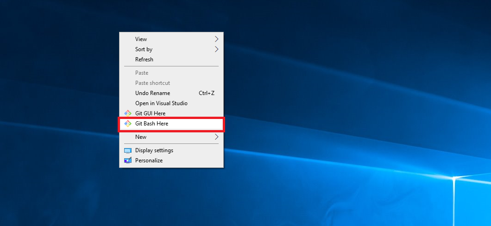
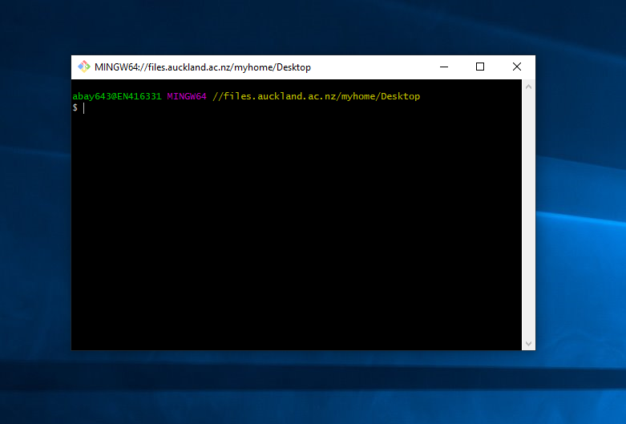
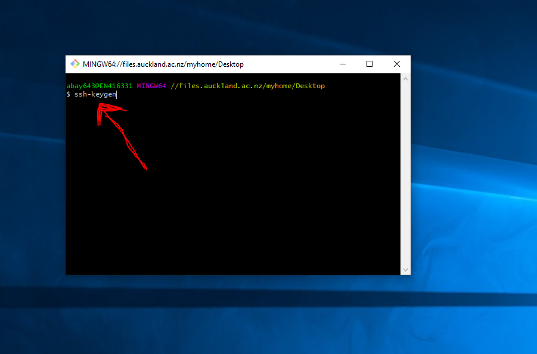
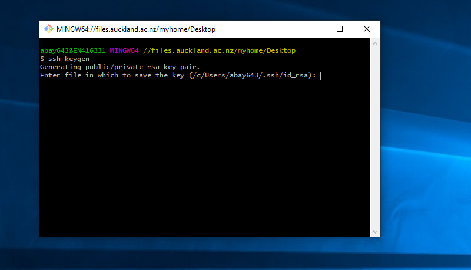
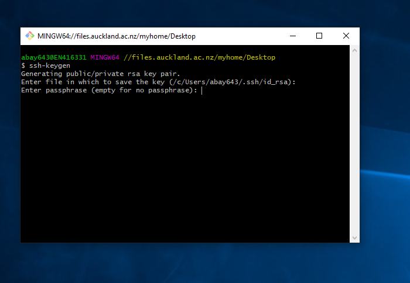
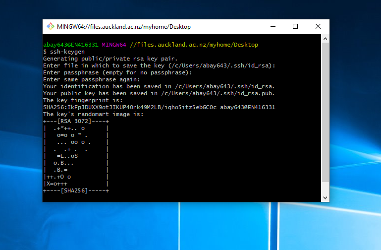
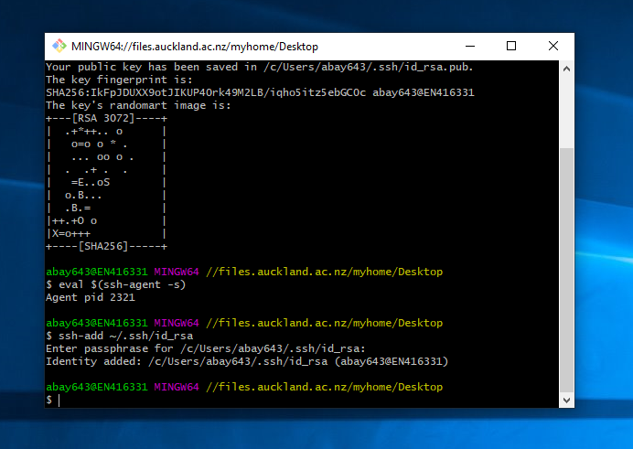
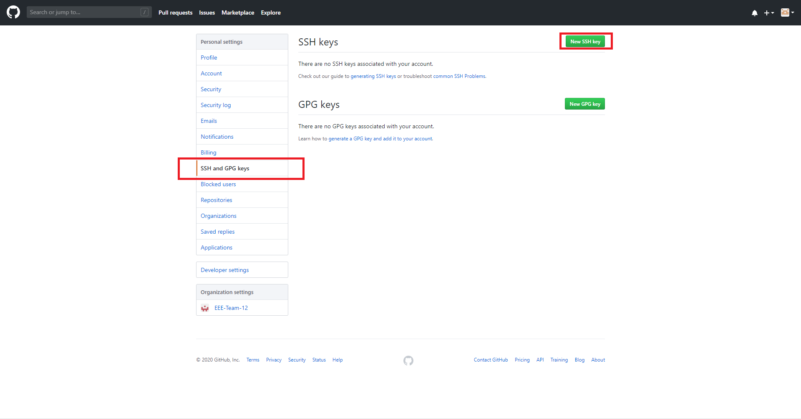
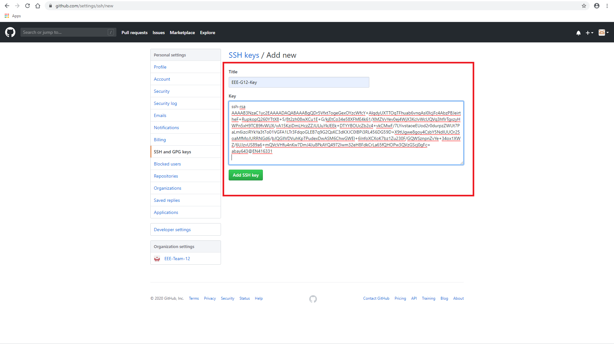

# Setting up Git (Windows)

**1.**  If you dont have **git** in your computer already you can download it from [here](https://git-scm.com/downloads).

**Note:** Engineering lab computers should already have git installed.

**2.**  Go to desktop then press right click , you should see the following:

then click **Git Bash Here**. You should see the following:

**3.** On the on the git bash terminal , type this command **`` ssh-keygen ``**.

press enter , then you should see the following:

- press enter again. This time it will ask you to provide a **passphrase**. I recomend to make this passphrase short e.g. eee , lol , ez , asd ect...

once the **passphrase** is configured successfully you should see this.

- then on the terminal , type this command **`` eval $(ssh-agent -s) ``** then press enter.

- then type this command **`` ssh-add ~/.ssh/id_rsa``** then press enter. Then provide your passphrase. If successful you should see the following:

**4.** Go to [github](https://github.com/) , then log in to your account. 

Once your logged in:

- nagivate to settings in your account , located on top right.

- nagivate to **SSH and GPG keys** , then click ** New SSH Key**

- give title to ssh key , then paste the ssh key like so:

then press **add ssh key**

 

